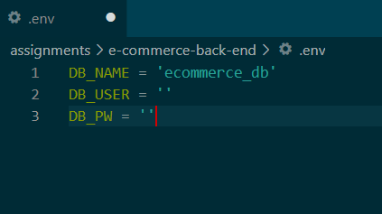
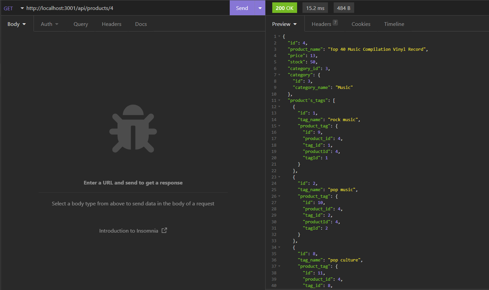

# E-commerce Back End

## Description

This is back end code for an e-commerce site which allows the user to make get, post, put, and delete requests in order to view, create new, update, and delete products, categories, and tags.

## Installation

This application requires node.js and MySQL Server. Open the main folder containing "server.js" of the application in a terminal and enter "npm install".

## Usage

Open a MySQL shell in the "db" folder and enter "source schema.sql" in order to create the "ecommerce_db" database. This will also drop any existing database with that name. Create a .env file and add your MySQL username and password and the name of the database, as shown below. Open the main folder containing "server.js" in a terminal and enter "npm run seed" to seed the database. Make HTTP requests using the routes in the routes/api folder.

https://github.com/BrendanShelton/e-commerce-back-end

## Credits

N/A

## License

MIT License

Copyright (c) 2022 BrendanShelton

Permission is hereby granted, free of charge, to any person obtaining a copy
of this software and associated documentation files (the "Software"), to deal
in the Software without restriction, including without limitation the rights
to use, copy, modify, merge, publish, distribute, sublicense, and/or sell
copies of the Software, and to permit persons to whom the Software is
furnished to do so, subject to the following conditions:

The above copyright notice and this permission notice shall be included in all
copies or substantial portions of the Software.

THE SOFTWARE IS PROVIDED "AS IS", WITHOUT WARRANTY OF ANY KIND, EXPRESS OR
IMPLIED, INCLUDING BUT NOT LIMITED TO THE WARRANTIES OF MERCHANTABILITY,
FITNESS FOR A PARTICULAR PURPOSE AND NONINFRINGEMENT. IN NO EVENT SHALL THE
AUTHORS OR COPYRIGHT HOLDERS BE LIABLE FOR ANY CLAIM, DAMAGES OR OTHER
LIABILITY, WHETHER IN AN ACTION OF CONTRACT, TORT OR OTHERWISE, ARISING FROM,
OUT OF OR IN CONNECTION WITH THE SOFTWARE OR THE USE OR OTHER DEALINGS IN THE
SOFTWARE.